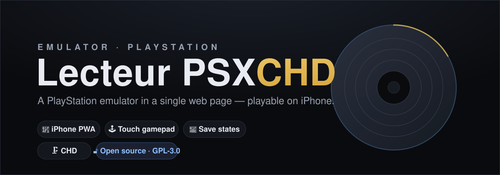

*(English version — [Version française](README.fr.md))*

# 🎮 Lecteur PSX CHD

**A PlayStation (PS1) emulator in a single web page**, designed to run as a **PWA on
iPhone** (Safari) — but it also works on desktop Firefox and Chrome.

Load a game as a **`.chd`** file (or `.cue/.bin`, `.iso`, `.pbp`…) and play: video, sound,
**touch controls**, save states, history. Everything stays **local** — nothing is uploaded.

> ⚙️ This project **assembles** outstanding open-source building blocks (see
> [CREDITS.md](CREDITS.md)). All emulation credit goes to their authors.



> 📸 *Real screenshots welcome — add them to [`screenshots/`](screenshots/) (home screen,
> in-game, the touch gamepad on iPhone) and reference them here.*

---

## ✨ Features

- ▶️ **PS1 emulation** via the **pcsx_rearmed** core compiled to WebAssembly (multi-threaded).
- 📄 **Single self-contained HTML page** (core + engine inlined) + a service worker.
- 📱 **iPhone PWA**: "Add to Home Screen", playable offline.
- 🕹️ **On-screen touch gamepad** (D-pad, ○✕□△, L/R, Start/Select, sticks) **and** keyboard.
- 💾 **Save states** (in-page, file export/import) + **memory card**.
- ⏱️ **Auto-save** every 30 s (crash safety net).
- 🗂️ **Recent games history**, with resume.
- 🧠 **Memory-optimised**: big games (Final Fantasy VII/VIII) playable on iPhone.
- 🌍 **SBI support** (libcrypt protection, PAL games).
- 🗜️ **ISO/BIN/CUE → CHD converter** included (`tools/chd-converter`).

## 🧩 Built on

| Component | Role |
|---|---|
| [pcsx_rearmed](https://github.com/notaz/pcsx_rearmed) | PS1 emulation core |
| [RetroArch](https://github.com/libretro/RetroArch) | emscripten build / libretro frontend |
| [libchdr](https://github.com/rtissera/libchdr) | CHD file reading |
| [Nostalgist.js](https://github.com/arianrhodsandlot/nostalgist) | driving the core in the browser |
| [Emscripten](https://emscripten.org/) | C → WebAssembly compilation |
| [chdman (MAME)](https://www.mamedev.org/) | CD/DVD → CHD conversion |

Details, pinned versions and licences: **[CREDITS.md](CREDITS.md)**.

## 🛠️ How it works (in short)

A **threaded** core (pthreads) → requires `SharedArrayBuffer` → requires a **cross-origin
isolated** context (COOP/COEP headers, provided by the service worker). Rendering uses
**WebGL2** via **OffscreenCanvas** on the render thread. The (compressed) **CHD** disc is
written in chunks into the virtual filesystem so it fits in an iPhone's memory budget.

The full **challenges & solutions** (loading an inlined threaded core, cross-thread WebGL,
COOP/COEP, memory, SBI, the WORKERFS dead-end…) are in
**[docs/architecture.md](docs/architecture.md)**.

---

## 🚀 Usage

### You need
- A game **you own the disc of**, preferably as a **`.chd`** (compressed, lightweight).
  To convert your ISO/BIN/CUE to CHD → see [`tools/chd-converter`](tools/chd-converter).
- (Optional) a **PlayStation BIOS** (`scph*.bin`) — otherwise the player uses **HLE**
  (simulated BIOS). **The BIOS is not provided** (Sony copyright).

### Test locally (desktop)

⚠️ It does **not** work by double-clicking (`file://`): the threaded core requires a served
context with COOP/COEP. Use the tiny bundled server:

```bash
python3 serve/lancer_lecteur_psx.py
```

It serves the page with the right headers and opens your browser at
`http://127.0.0.1:8901/lecteur-psx.html`.

> **Brave/Chrome**: a black screen usually means GPU acceleration is disabled
> (`chrome://gpu` → `WebGL: Disabled`). Enable `chrome://flags/#ignore-gpu-blocklist`
> and hardware acceleration, or use **Firefox**.

### Install as a PWA on iPhone

1. Serve `lecteur-psx.html` **+ `sw.js`** over **https** (required for isolation). A free
   static host (GitHub Pages, Netlify…) works: the `sw.js` supplies the COOP/COEP headers.
2. Open the URL in **Safari** → **Share** → **Add to Home Screen**.
3. Launch from the icon, load a `.chd`, play.

> Note: GitHub Pages serves the page fine but does not send COOP/COEP → the included
> `sw.js` handles it after the first load.

### Convert your discs to CHD

See [`tools/chd-converter/README`](tools/chd-converter). In short (requires `chdman`,
package `mame-tools`):

```bash
python3 tools/chd-converter/iso2chd.py my-game.cue      # → my-game.chd
python3 tools/chd-converter/iso2chd_app.py             # native GUI (Tkinter)
```

### Publish it with GitHub Pages

The repo includes a landing page (`index.html`) and works on **GitHub Pages** out of the box:

1. Repo **Settings → Pages → Source: `main` / root**, save.
2. Your site goes live at `https://<user>.github.io/<repo>/` (the landing page), with the
   player at `…/lecteur-psx.html`.

GitHub Pages doesn't send COOP/COEP, but the bundled `sw.js` supplies them (the landing
page pre-registers it), so the threaded core runs isolated.

## 📦 Supported formats

`.chd` (recommended), `.pbp`, `.cue`+`.bin`, `.iso`, `.img`, `.mdf`, `.m3u`, plus `.sbi`
(libcrypt protection — select the `.chd` **and** its `.sbi` together).

## 🔧 Rebuild the core from source

The embedded WASM core is fully reproducible:

```bash
cd build && ./build.sh
```

See **[build/README.md](build/README.md)** (⚠️ a **space-free path** is required).

## 🧭 Limitations & roadmap

- **Single-disc** for now → **multi-disc** (FF7 = 3 CDs, in-game disc switching) is next.
- **Interpreter** (no dynarec, iOS forbids JIT): full speed for FF and most games; heavy
  3D titles may occasionally miss the target framerate.
- **Lazy CHD loading** (minimal RAM): proven feasible, not wired in yet.

## 📜 Licence

**GPL-3.0-or-later** — the embedded core combines GPL-2.0 code (pcsx_rearmed) linked via
RetroArch (GPL-3.0). See [LICENSE](LICENSE) and [CREDITS.md](CREDITS.md). Build sources are
provided in [`build/`](build/).

### ⚠️ No BIOS, no games
This repository contains **no BIOS and no ROM/game**. Only use backups of **your own**
games. "PlayStation" is a trademark of Sony Interactive Entertainment; this project is not
affiliated.

## 🙏 Thanks

To **notaz**, the **RetroArch/libretro** team, **arianrhodsandlot** (Nostalgist.js),
**Romain Tisserand** (libchdr), and the **Emscripten** and **MAME** teams. None of this
would be possible without them.
